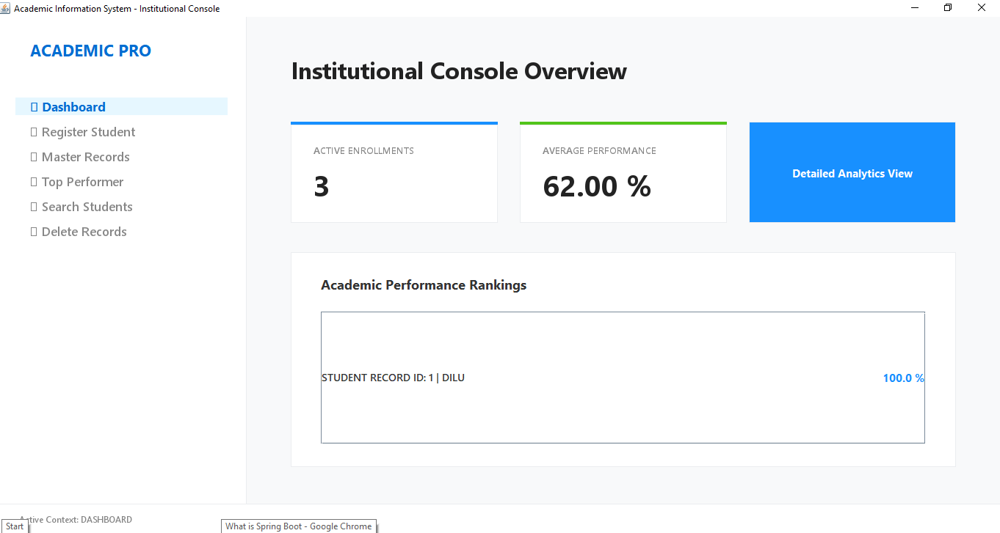
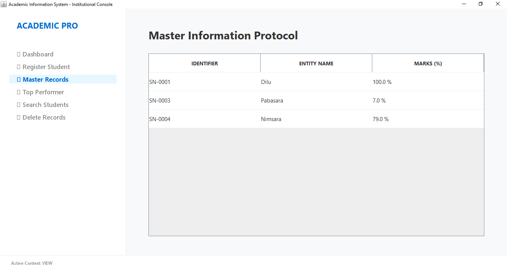

# 🎓 Advanced Student Management Dashboard

A full-featured desktop application developed using **Java Swing** and **PostgreSQL** to manage and analyze student data efficiently. This system provides a clean and interactive dashboard along with powerful CRUD operations and student performance insights.

---

## 🚀 Features

- 📊 Interactive Dashboard with statistics  
- ➕ Add New Students  
- 📋 View All Student Records  
- 🔍 Search Students بسهولة (by name, ID, etc.)  
- ✏️ Update Student Details  
- ❌ Delete Student Records  
- 🏆 Identify Top-Performing Students  
- 📈 Basic Student Performance Analytics  

---

## 🖼️ Screenshots

### 📌 Main Dashboard


### 📌 View Students


---

## 🛠️ Technologies Used

- **Java (Swing)** – GUI Development  
- **PostgreSQL** – Database Management  
- **JDBC** – Database Connectivity  

---

## ⚙️ How to Run

1. Clone the repository:
```bash
git clone https://github.com/your-username/your-repo-name.git